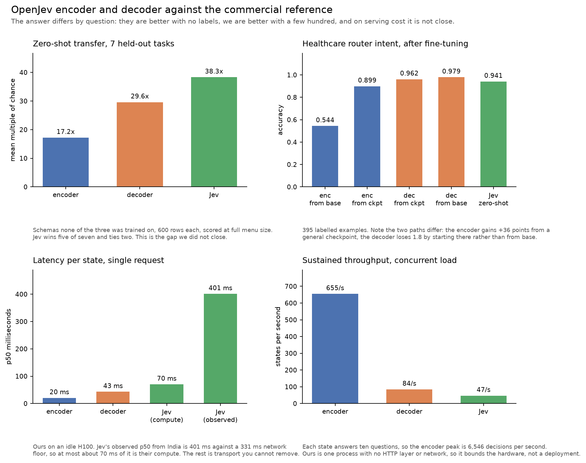

<h1 align="center">OpenJev</h1>

<p align="center">
  <b>Typed decisions from a small model you can train yourself.</b><br>
  State in, typed answers with calibrated probabilities out. No text generation.
</p>

<p align="center">
  <a href="LICENSE"></a>
  
  
  
  <a href="report/main.pdf"></a>
  <a href="https://buymeacoffee.com/prathams"></a>
</p>

---

## What this is

OpenJev answers typed questions about a state: pick one of N options, place it
on an ordered rubric, or return P(true) for a yes/no gate. Every question is
answered in one forward pass over a shared state, so asking twenty costs about
the same as asking one, and nothing is generated so there is nothing to parse.

**The default architecture is a rank-16 LoRA adapter on Qwen3-1.7B.** It won
the architecture ablation against the ModernBERT encoder on all seven held-out
benchmarks, 29.6x chance against 17.2x, including 0.605 against 0.343 on
Banking77 having never seen it, and it is what our best router fine-tune uses.
Start with the
[general LoRA adapter](https://huggingface.co/s1lv3rj1nx/openjev-general-lora).

One measurement went the other way and it is worth knowing before you trust
the benchmarks: run zero-shot on our real router task, the encoder is better
(intent 0.601 against 0.467). See
[results that went against us](#results-that-went-against-us).

The ModernBERT encoder is still published and still supported, as the
alternative for two specific tradeoffs: p95 latency (20 ms against 56 ms at
batch 1) and footprint (0.6 GB against 3.4 GB). You pay for both in accuracy.

This is a fine-tune-first tool. Given a few hundred labels it beats the closed
commercial API it was built to understand, on the task it was trained on.
Zero-shot it does not, and that gap is stated in full below.

## Quick start

```bash
git clone https://github.com/S1LV3RJ1NX/openjev && cd openjev
uv sync
```

```python
from openjev import DecisionModel, Choice

model = DecisionModel.from_pretrained("s1lv3rj1nx/openjev-general-lora")

out = model.answer(
    "my card got declined at the grocery store",
    {"intent": Choice(
        instructions="Which banking intent is this?",
        criteria={"declined_transaction": None,
                  "card_lost": None,
                  "top_up_failed": None},
    )},
)

out["intent"].label    # the winning option
out["intent"].p_max    # its probability
```

`criteria` maps each option to an optional description. Pass `None` when the
label speaks for itself. The label set is model input, not weights, so it can
change between calls without retraining anything.

The LoRA adapter is merged into the base weights on load, which costs 1.07x an
unadapted model. Leaving it unmerged costs 1.96x for nothing, so
`from_pretrained` always merges.

One thing to know before you pass a long menu: the state and every option have
to pack into one sequence, and the packer refuses rather than dropping options
it cannot fit. Pass `max_len` when that happens. A 151-way menu with
descriptions needs around 6144.

### Asking several questions at once

```python
from openjev import DecisionModel, Choice, Noul, Score

model = DecisionModel.from_pretrained("s1lv3rj1nx/openjev-router-lora")

out = model.answer(
    "I need a refill on my thyroid tablets, and are you open on Sunday?",
    {
        "intent": Choice(
            instructions="What is this about?",
            criteria={"refill": "another fill of a prescription",
                      "store_hours": "when a branch is open"},
        ),
        "urgency": Score(
            instructions="How time-critical is this?",
            criteria=["can wait", "today", "immediate"],
        ),
        "needs_human": Noul(instructions="Does this need a human?"),
    },
)

out["intent"].probabilities        # {"refill": ..., "store_hours": ...}
out["intent"].confidence           # chance-corrected, comparable across menus
out["urgency"].score               # the expected level, not the argmax
out["urgency"].is_unimodal         # False means that expected level describes nothing
out["needs_human"].probabilities["true"]
```

Many states at once, same shared-prefix trick, one batch:

```python
flags = model.answer_batch(
    ["when do you close today", "my chest hurts badly"],
    {"clinical": Noul(instructions="Does this describe a clinical symptom?")},
)
[f["clinical"].probabilities["true"] for f in flags]
```

| primitive | returns | use for |
|---|---|---|
| `Choice` | one of N options, with probabilities | routing, intent, classification |
| `Score` | a number on an ordered rubric | urgency, severity, quality |
| `Noul` | P(true) | flags, gates, multi-label |

Multi-label is `Noul` per label, not `Choice`: a message can be about a refill
and about opening hours at once, and a softmax cannot say so.

## Which should I use, and when

**You have no labels and a schema you invented today.** Use the general LoRA
adapter zero-shot. It reaches 29.6x chance across seven held-out tasks,
including 0.702 on a 151-way menu. If you can send your data to an API, Jev is
the better zero-shot model on every one of those seven tasks: 38.3x chance
against our 29.6x, winning five and tying two. Reasons to use ours anyway: the data never leaves your
network, you get full-precision probabilities rather than values quantized to
0.01, and you get determinism, which Jev does not offer.

**You are serving high volume.** Use the encoder. On an idle H100 it sustains
654 states per second, which is 6,546 decisions per second at ten questions
each, against the decoder's 84. That is roughly 8x, and it is a wider gap than
the accuracy difference running the other way. For reference, Jev peaks near 47
requests per second before its median latency climbs.

**You have a few hundred labels.** Train a task adapter, and train it from the
base weights rather than from the general adapter. This is the case where we
beat Jev: 395 examples and 258 seconds on one H100 gave three wins, four ties
and no losses on the healthcare router. Initialising from the general adapter
instead is measurably worse (0.953 against 0.979, p = 0.012), so the general
adapter is for zero-shot use, not for initialisation.

**Tail latency binds, or the footprint does.** Use the encoder. p95 20 ms at
batch 1 against the decoder's 56 ms, and 0.6 GB against 3.4 GB. You give up
accuracy: 17.2x chance on the held-out suite against the decoder's 29.6x, and
0.343 against 0.605 on unseen Banking77.

**You are building a safety gate.** Train it. Do not ship one zero-shot on
either architecture. Our trained pharmacy scope gate reaches 0.978 against
Jev's 0.880, but run the general decoder zero-shot on the same router and
intent accuracy is 0.467, below the encoder's 0.601. Public benchmark scores
did not predict readiness on a real task, on either backbone.

| | LoRA decoder (default) | encoder |
|---|---|---|
| held-out mean | **29.6x chance** | 17.2x |
| Banking77, unseen | **0.605** | 0.343 |
| p95 latency, batch 1 | 56 ms | **20 ms** |
| footprint | 3.4 GB | **0.6 GB** |
| per-task artifact | **87 MB adapter** | a full checkpoint |

**Neither is a good fit** if you have no labels and need arbitrary schemas to
work today (use Jev), or if your states are short and carry one question, in
which case the shared prefix buys nothing and a plain classifier is simpler.
The fit is good for high-volume routing, triage, guardrails and tool selection
where you have labels, for long states asked many questions at once, for
regulated data that cannot leave your network, and for anything that needs a
real probability to threshold on.

## All four comparisons in one place



The answer differs by question, which is why there is no single headline
number. They are better with no labels. We are better with a few hundred. On
serving cost it is not close. Every figure is measured and sourced in
[`docs/results.md`](docs/results.md).

## What it does on schemas it never trained on

Seven held-out tasks, none in the training mixture, contamination enforced by
an automated guard. 600 rows each, scored at full menu size. The three that
matter, because choosing among a large menu you have never seen is the
capability worth having:

| task | K | decoder | encoder | Jev |
|---|---|---|---|---|
| clinc_oos | 151 | 0.702 | 0.382 | **0.938** |
| massive_intent | 60 | 0.775 | 0.473 | **0.838** |
| banking77 | 77 | 0.605 | 0.343 | **0.863** |
| **mean, all 7** | | 29.6x | 17.2x | **38.3x** |

Four-way and five-way tasks are the honest limit, better than guessing and not
much more. Full table, intervals, majority-class baselines and the
contamination manifest are in [`docs/results.md`](docs/results.md) and the
[report](report/main.pdf).

### Jev is ahead here, and what we think that means

It wins five of the seven and ties two. The per-item predictions are in
[`baselines/`](baselines/) so you can check that without an API key.

We do not think that means the recipe is wrong, and here is the evidence
either way.

**Every time we added data, generalization went up, and it never stopped
going up.** The first mixture of 61 tasks transferred nothing at all, 0.9x
chance, which is to say a coin flip with extra steps. Padding training menus
with distractor labels took Banking77 from a literal 0.000 to 0.205. Scaling
and auditing to 279 tasks and 323,466 rows reached the numbers above. Three
interventions, three improvements, no plateau in sight. That is the shape of a
curve you have not finished climbing, not one that has flattened.

**We stopped because of what we had, not because of what we learned.** One
person, one GPU, 323,466 rows curated from public datasets. Flan-scale
instruction mixtures are one to two orders of magnitude larger. We did not
run out of ideas, we ran out of budget.

**And we cannot see what Jev was trained on.** It is a closed API. Its
architecture, its training corpus and its scale are all unobservable to us.
So we cannot prove the remaining gap is a data-scale gap rather than
something they know that we do not. What we can say is that our own scaling
curve points at data, and that nothing we measured suggests the method itself
is the limit.

So treat the zero-shot number as a statement about our budget, and treat the
next section as the load-bearing claim. **The part we can prove is that the
recipe works when you point it at your own task.**

## What it does once fine-tuned on your task

Paired exact McNemar against Jev on the same 450 healthcare router items,
after fine-tuning a LoRA adapter on 395 examples.

| | OpenJev | Jev | p |
|---|---|---|---|
| intent | **0.979** | 0.941 | 9.8e-04 |
| multi-label exact set | **0.909** | 0.822 | 7.2e-06 |
| pharmacy scope gate | **0.978** | 0.880 | 3.9e-10 |
| compound exact set | 1.000 | 0.909 | level |
| `compound_3`, three intents at once | 0.903 | 0.645 | 0.057, level at n = 31 |
| oblique clinical risk, recall | 0.966 | 0.793 | 0.063, level at n = 29 |
| clinical / abusive / injection gates | 0.987 / 0.993 / 0.993 | 0.978 / 0.996 / 0.996 | level |

Three wins, four ties, no losses, from 395 examples, 258 seconds on one H100
and an 87 MB adapter.

**The comparison is asymmetric and in our favour: we are fine-tuned on this
task and Jev is zero-shot on it.** It is not evidence that an open 1.7B model
matches a closed API in general. What it shows is that a few hundred labels
outweigh that gap on one task. The two rows marked underpowered have tens of
items, not hundreds, so treat them as unresolved rather than as ties on the
merits.

Reproduce with `scripts/compare_to_jev.py`.

## Train a task adapter on your own data

**1. Build a task from a CSV.**

```bash
uv run python scripts/make_task.py --csv mydata.csv \
    --text-column message --label-column intent --name my_task
```

That writes `tasks/my_task/` with a stratified split and a `choice` question.
The format is two file types and is specified in
[docs/dataset-format.md](docs/dataset-format.md), with a template.

**2. Write the option descriptions.** The scaffold leaves `TODO` placeholders
and this is the step worth your time. Descriptions that state what
distinguishes a label from its neighbours were worth +5 accuracy points on
Banking77, while descriptions that merely restated the label name were worth
nothing (p = 0.75).

**3. Train, from the base weights.**

```bash
uv run python scripts/train.py --task tasks/my_task \
    --decoder --lora-r 16 --backbone Qwen/Qwen3-1.7B \
    --epochs 6 --bs 4 --lr 2e-4 --max-len 3072
```

Do not pass `--init-from` the general adapter here. It is worse than base on a
narrow task, and the measurement is in the negative results below. The encoder
has its own recipe and needs its own output directory, since a checkpoint of
one architecture refuses to overwrite the other:

```bash
uv run python scripts/train.py --task tasks/my_task --epochs 6 --bs 8 \
    --out checkpoints_encoder
```

**4. Evaluate, then use.** Training fits calibration temperatures on `dev` and
saves them with the checkpoint, along with the backbone and the prompt format,
so inference cannot drift from training.

```bash
uv run python scripts/eval_router.py \
    --ckpt checkpoints/my_task/model.pt --max-len 3072
```

Check per-class recall rather than accuracy before trusting anything. A class
with a handful of examples gets learned as "never predict this": ours scored
0.000 recall while the model looked 0.984 accurate.

## Is packing actually better than one model per question?

Yes, on both counts, and we expected only one of them.

| | 10 separate models | 1 packed model |
|---|---|---|
| mean accuracy over 10 questions | 0.9525 | **0.9648** |
| hardest question, 14-way intent | 0.8521 | **0.9231** |
| latency for all 10 | 204.9 ms | **20.4 ms** |
| artifacts to ship | 10, 6 GB | **1, 0.6 GB** |

We predicted packing would lose accuracy and win on cost, because a
dedicated model has more capacity per question. It wins both. The likely
reason is supervision: at 395 examples a single-question model sees 395
labels, while the packed model sees the same states carrying ten labels
each. The gap is largest on the hardest question and reverses on three
easy binary ones already above 0.96.

## Results that went against us

These are kept here rather than in a footnote because they change what you
should do.

- **Benchmark transfer did not predict deployment readiness.** The decoder
  wins all seven public held-out tasks, and loses to the encoder zero-shot on
  the real router (intent 0.467 against 0.601). The ranking reverses on the
  one task with an operational shape. Neither model is usable zero-shot for
  safety gates.
- **Intermediate-task initialisation hurts the decoder.** A router adapter
  started from the general adapter scores 0.953 against 0.979 from base
  Qwen3, p = 0.012. This is the opposite of the encoder result, where the
  same move was worth +36 points. Base Qwen3 already reads menus, so the
  mixture adds interference rather than capability.
- **Zero-shot is behind the commercial API on every task we measured.** We
  spent most of this project comparing on Banking77 alone and calling it a
  21-point gap. Running Jev over the full held-out suite shows it wins five
  of seven and ties the other two, 38.3x chance against our 29.6x. The
  per-item predictions are in `baselines/` so you can check it. No claim of
  zero-shot parity is made anywhere in this repo.

## Where you come in

Zero-shot ability on typed decisions came from task diversity in the training
data rather than from the architecture, and our mixture is lopsided towards
`choice` tasks. What would help most, in order: ordinal (`score`) tasks, of
which we have very few; yes/no (`noul`) tasks; and anything with a menu past
20 options. The [evaluation harness](docs/evaluation.md) has a held-in control
and a contamination guard that refuses a mixture overlapping the evaluation
suite, so "no transfer" cannot be confused with a bug.

Everything here is base-sized. Scaling the backbone may move zero-shot
transfer, we have not measured it, and we are not claiming it either way.

## Models and datasets

| | |
|---|---|
| [**General LoRA adapter**](https://huggingface.co/s1lv3rj1nx/openjev-general-lora) | **Start here. 29.6x chance on held-out schemas, 0.605 on unseen Banking77** |
| [Router LoRA adapter](https://huggingface.co/s1lv3rj1nx/openjev-router-lora) | 87 MB, the worked example that beats the reference API on its own task |
| [General encoder](https://huggingface.co/s1lv3rj1nx/openjev-encoder-general) | 17.2x chance, 20 ms p95, 0.6 GB. Use when latency or footprint binds |
| [Encoder router](https://huggingface.co/s1lv3rj1nx/openjev-router-healthcare) | The same task on the encoder path |
| [Training mixture](https://huggingface.co/datasets/s1lv3rj1nx/openjev-mixture) | 279 tasks, 323,466 rows, audited clean |
| [Held-out suite](https://huggingface.co/datasets/s1lv3rj1nx/openjev-heldout) | 7 tasks and the contamination manifest |
| [Router dataset](https://huggingface.co/datasets/s1lv3rj1nx/openjev-healthcare-router) | 988 items across 18 tiers, built to have headroom |

## Documentation

The [**technical report**](report/main.pdf) is the full account: method, every
experiment, and every result with its intervals. Start there for anything this
README summarises. LaTeX source is in [`report/`](report/).

| | |
|---|---|
| [Results](docs/results.md) | Every measurement with the command that produced it |
| [Ablations](docs/ablations.md) | Every experiment, what it isolated, what it decided |
| [Architecture](docs/architecture.md) | The design, with diagrams, and why each choice |
| [Dataset format](docs/dataset-format.md) | The spec, a template, and the mistakes we made |
| [Evaluation](docs/evaluation.md) | The two suites and the contamination guard |
| [Prior art](docs/prior-art.md) | UniMC, PCW, CORN, ADB. Most of this exists |

## Honesty policy

Every Jev figure was measured by us against the public API (`jev-1.13.0`,
20 Sep 2026) at stated sample sizes, with the caveats kept next to the
numbers. Negative results are documented as prominently as positive ones, and
[docs/results.md](docs/results.md) lists the claims we retracted after better
measurement. No claim of zero-shot parity with Jev is made anywhere, because
the numbers do not show it.

## Support

Everything here stays free. If it saved you time,
[buy me a coffee](https://buymeacoffee.com/prathams).

## Licence

Apache 2.0. Dataset rows keep their upstream licences; see
[`tasks/heldout/README.md`](tasks/heldout/README.md).
