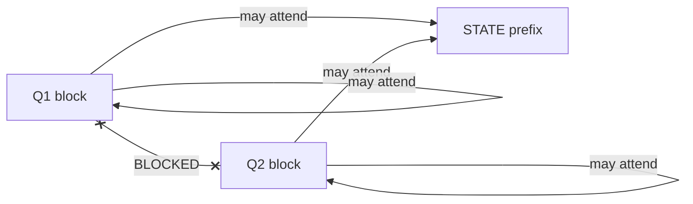
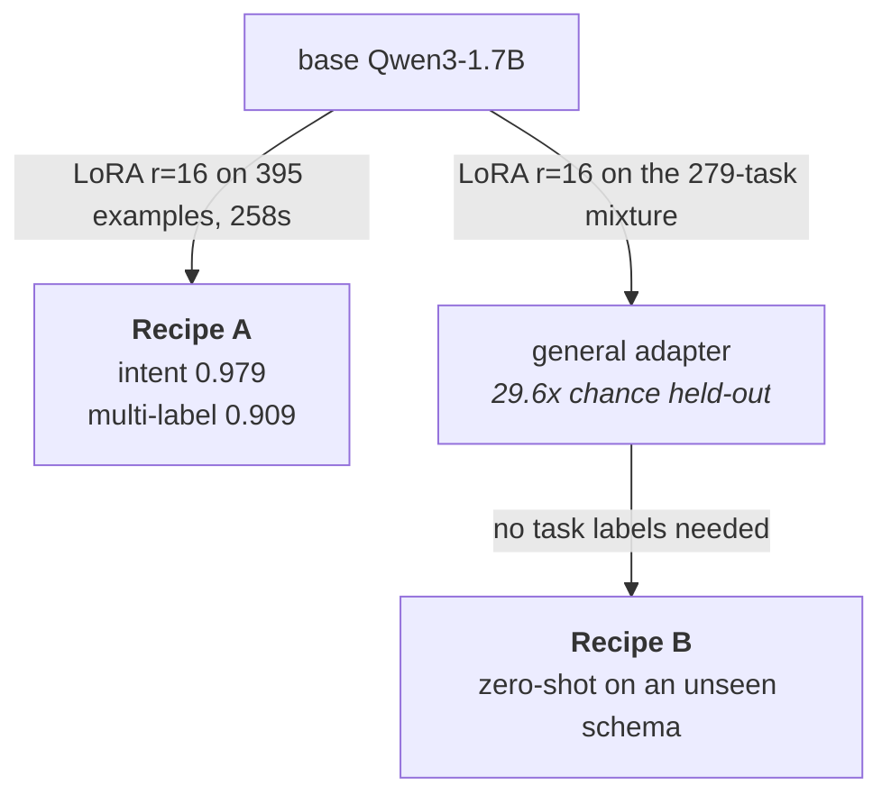

# Architecture

How the model is put together and why. The formal treatment, with the mask
equation, the grouped-softmax loss and the worked example, is in
`report/sections/method.tex`. What is here is the shape of the design, the
measurements that justify individual choices, and the things we decided not
to build.

## At a glance

The default backbone is a causal decoder, Qwen3-1.7B, adapted with rank-16
LoRA. "Decoder" names the attention pattern, not the use: nothing is
generated token by token. Inference is one forward pass with a parallel
read at marker positions.


The encoder path, ModernBERT with a shared `Linear(d, 1)` scorer at the
marker, is the same diagram with a different readout. It remains supported
as the low-latency alternative.

Nothing is generated. The cost of asking more questions is the length of
the questions, not another pass over the state.

## The core idea: options are input, not output

A normal classifier ends in `Linear(d, n_classes)`, so the label set is
baked into the weights. A new label means a new column and retraining.

Instead, write each option's text into the input, put a marker token next
to it, and read one score per marker:

```python
logits = readout(h[marker_positions])   # one score per option, no per-class weights
probs  = softmax(logits)                # over however many markers this question has
```

The model is not learning "class 37". It is learning a matching function:
how well does this option description fit this state? Swapping the label
set changes the input, not the parameters. That is what makes a
runtime-variable menu possible at all, and it is the prerequisite for
zero-shot transfer.


This is not novel. UniMC does exactly this at 235M parameters, down to the
option-mask token and the attention masking that stops options
interacting. See [prior art](prior-art.md).

**Measured: semantics are read from wherever they sit.** On a 10-option
intent task, descriptive option *keys* with no descriptions, and opaque
keys (`option_0` and so on) carrying the real descriptions, scored the
same 75.0% on the same items (n=40). So both the key and the description
belong inside the marker's span, and renaming a label changes the task.

## Many questions, one pass

UniMC handles one question per sequence. The piece this project adds is
answering *every* question about a state in a single forward pass: pack the
state once as a shared prefix, then one block per question, with
block-diagonal attention so each question sees the state and its own
options but not its siblings.

```
[ STATE tokens ][ Q1 + its option markers ][ Q2 + its markers ] ... [ QN ... ]
  shared prefix    attends to STATE and       attends to STATE and
                   its own block only         its own block only
```



**Verified rather than assumed.** Adding ten sibling questions that
explicitly assert the answer moved the target's probability vector by
0.0022 mean absolute deviation against a **0.0029 replication noise
floor**, below the floor, with 0 of 30 argmax flips. One question cannot
prompt-inject another.

**That it is worth doing.** On a hosted reference endpoint, asking 30
questions instead of 1 about the same 800-word state cost 1.56x the input
tokens and no measurable extra latency (slope 0.12 ms per question), and a
16k-token state with 100 questions returned in under a second, which is not
possible if each question re-encodes the state. Option count behaves the
same way: 2 to 100 options changed latency by nothing measurable.

Our own packed-against-naive benchmark, including the case where packing
buys nothing, is in [results](results.md#packing-against-one-sequence-per-question).
Reproduce it with [`scripts/bench_packing.py`](../scripts/bench_packing.py).

**FlexAttention is not needed yet.** The mask is an explicit 4D additive
tensor run through SDPA, which is O(L²) and gets no block-sparsity
benefit, and at these sequence lengths it is already flat.
FlexAttention's `BlockMask` becomes relevant only at much longer packed
sequences. It is also what would raise the memory ceiling on training,
since an explicit mask drops off the flash path and materialises attention
scores in every layer.

## Two recipes, and which to use



**Recipe A, straight LoRA fine-tune from base, is what you want if you have
labels.** Roughly 400 examples is enough, and it is the configuration that
beats Jev on the router. Do *not* route it through the general adapter
first: that is measurably worse on the decoder path (0.953 against 0.979,
p = 0.012), which is the reverse of the encoder result. See
[negative result 3](results.md#3-starting-a-task-adapter-from-the-general-adapter-is-worse).

**Recipe B, the general adapter, is for schemas you have no labels for.**
It is the only option there, and it is genuinely better than the encoder at
it (29.6x against 17.2x chance). It is also not deployment-ready on a real
task, so read
[negative result 2](results.md#2-the-decoder-transfers-better-and-deploys-worse)
before relying on it.

On the encoder path the ordering is different: going via the general
checkpoint is worth **+36 points** of intent accuracy, because the encoder
has to learn what a menu is and the mixture teaches it. That is the whole
argument for the project shipping a general model rather than only a
trainer, and it is the one place where the encoder's recipe is not simply
the decoder's recipe made smaller.

## Backbones

| | decoder, default | encoder, alternative |
|--|--|--|
| model | `Qwen/Qwen3-1.7B` | `answerdotai/ModernBERT-base` |
| parameters | 1,725M | 150M |
| attention | causal, block-diagonal per question | bidirectional, block-diagonal per question |
| readout | `logit(yes) - logit(no)` at the marker | shared `Linear(d, 1)` at the marker |
| adaptation | LoRA r=16, 87 MB adapter | full fine-tune, 0.6 GB |
| p95 at batch 1 | 56 ms | 20 ms |

Take the encoder when p95 latency binds or when a 0.6 GB footprint matters
more than the accuracy. Take the decoder otherwise.

The warm start is not a lever. Reusing a pretrained masked-LM head at the
marker adds no parameters and can be run untrained, and it scores **0.7x
chance** on ModernBERT-base and 2.2x on large. A strong bidirectional
encoder plus a clever output format does not produce a zero-shot decision
model: the format makes zero-shot *possible*, it does not make it
*present*. Whether a larger encoder closes the gap is untested; that needs
ModernBERT-large and is not run.

## Loss

Plain cross-entropy, soft-label when distilling. Not policy gradient.

Any objective built on a strictly proper scoring rule over predicted
probabilities is uniquely maximised at the true conditional distribution,
and so is cross-entropy, because the logarithmic score *is* cross-entropy
up to sign. Such an objective therefore shares its optimum with ordinary
supervised training and cannot reach a solution gradient descent cannot.
It is also a smooth function of the reported distribution, so the gradient
is available in closed form as `softmax(z) - y`. Policy-gradient and
evolution-strategies estimators exist for rewards you *cannot*
differentiate through, and this is not one.

Reinforcement learning earns its place in exactly one part of this system,
and it is not the classifier: deciding **when to escalate** under
asymmetric costs. Even there, with calibrated probabilities the answer is
closed-form Bayes decision theory, and RL is only needed when you observe
outcomes but not labels, when the costs must be learned, or when the
decision is sequential.

## Ordinal `score`

`score` is currently a softmax over levels. The order is used only in
rendering and in an expectation-based readout, which is a limitation and
the ordinal primitive is where this project is weakest.

A softmax over rubric levels has no notion of order and can produce
distributions no ordered model should: mass on both extremes with a trough
between, reported as a confident middle. Measured on the reference
endpoint, **11.8% of `score` distributions were multimodal over ordered
levels.**

The fix would be a rank-consistent objective (CORN) and, for genuinely
bimodal posteriors that no ordinal head can represent, a second-order
output. Neither is implemented. Both, with the caveat that second-order
methods are provably unfaithful quantitatively, are covered in
[prior art](prior-art.md#ordinal-heads).

## Saying "none of these"

An enumerated output cannot produce an answer outside the set. That is the
guarantee and it is worth something. It also removes the model's ability to
*complain*, which is the part people forget.

Two mechanisms, for two different jobs. **Rejection** by adaptive decision
boundaries, fitted post hoc from in-scope data only and tuned for the
near-miss regime, which is where escape options are weakest. **Triage** by
independent `noul` gates: a single `none_of_the_above` bucket cannot
distinguish a medical emergency from a question about parking, and because
questions are independent blocks, separate gates are free. Only the second
is implemented. Papers in [prior art](prior-art.md#rejection-and-escalation).

## Confidence

Not a learned head. Computed from the distribution at serving time:

```python
def confidence(p, kind):
    k = len(p)
    if kind == "choice":
        return (max(p) - 1/k) / (1 - 1/k)            # chance-corrected top probability
    m = max(range(k), key=p.__getitem__)             # score: dispersion about the MODE
    return max(0.0, 1 - sum(pi*abs(i-m) for i, pi in enumerate(p)) / ((k*k//4)/k))
```

These are the two formulas the reference endpoint uses, recovered by
fitting against its outputs (mean absolute error 0.003 and 0.006, both
inside one quantization step of its reported precision). We reimplement
them so both systems can be scored by the same number rather than each by
its own notion of confidence.

Note the consequence: a chance-corrected top probability carries no
information the probabilities do not already have, and a confidence
threshold is **not portable across questions with different option
counts**.

## Things we are deliberately not doing

**No hierarchy for large label sets.** Measured on the reference endpoint,
chance-corrected accuracy was flat from 10 to 255 options, and padding a
real 77-label menu out to 255 synthetic labels changed nothing (0.807 to
0.817, p = 0.65). One flat softmax per question is correct and
coarse-to-fine would be wasted complexity.

**No per-option token budget.** Growing each option's description from 25
to 4,000 words at fixed option count cost nothing measurable. Plan against
total sequence length, not option count or option text length.

**No noise-robustness augmentation.** A paired measurement over the same
130 items, clean against degraded, found accuracy identical and McNemar
p = 1.0. Degradation reshuffles which items fail without changing how many.
Numbers in
[evaluation](evaluation.md#negative-result-skip-noise-robustness).

**No quantization of output probabilities.** Worth stating because the
reference endpoint rounds to 0.01, which puts 71.9% of returned values at a
hard `0.0` and makes log-odds, log loss and tail-risk reasoning
unavailable. It also creates ties that make some coverage levels
unreachable by thresholding.

## Where the remaining weakness is

Zero-shot transfer to schemas never seen in training. The architecture
makes it *possible*, since the readout has no per-class parameters, but
possible is not present, and the measurements say the gap is a data problem
rather than an architecture one. Our mixture is 234 `choice` tasks against
34 `noul` and 11 `score`, and the result pattern follows exactly: `choice`
transfers, the other two barely do.

The Flan Collection ablation shows held-out performance rising
log-linearly in task count and still improving at 1,836 tasks, with most of
the gain inside the first ~282. There is a tension to plan around in the
same ablation: **held-in performance peaks around 200 tasks and then
degrades.** A task-specific model and a general zero-shot model pull in
opposite directions past that point. Either ship two checkpoints, or take
task balancing seriously.

The full argument is in `report/sections/discussion.tex`.
