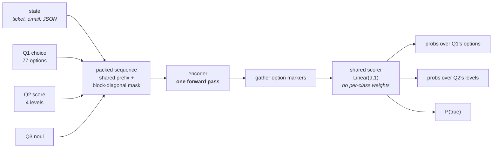
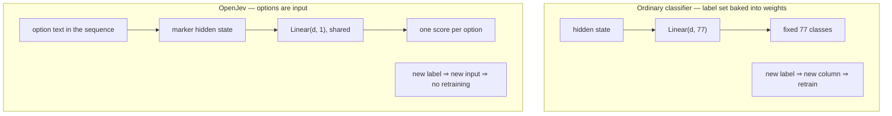
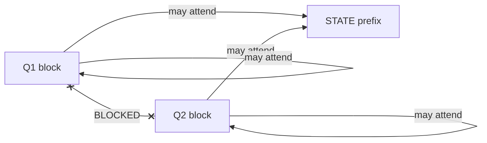
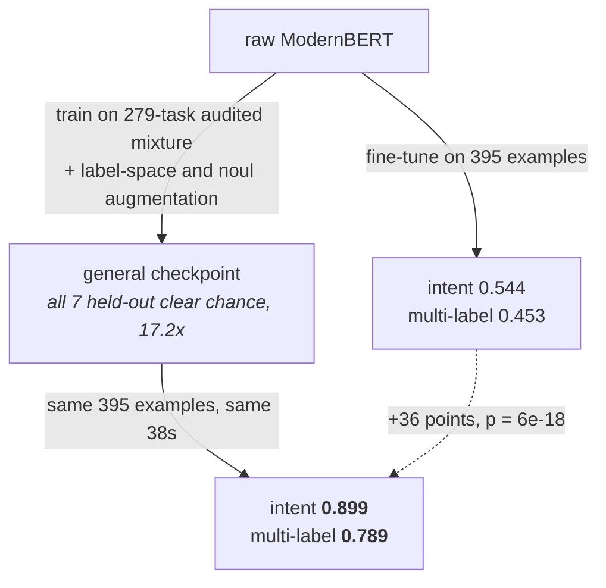

# Architecture

The design we intend to build, and the reasoning behind each choice. **None of
this is implemented yet.** Where a claim rests on measurement it says so and
gives the sample size; where it rests on published work it cites it; where it
is a bet, it says that too.

## At a glance



Nothing is generated. The cost of asking more questions is the length of the
questions, not another pass over the state.

## Why the output layer has no per-class weights



This is what makes a runtime-variable menu possible at all, and it is the
prerequisite for zero-shot transfer. Measured support: descriptive option
*keys* with no descriptions, and opaque keys (`option_0`…) carrying the real
descriptions, score the same 75.0% on the same items. The semantics are read
from wherever they sit.

## The core idea: options are input, not output

A normal classifier ends in `Linear(d, n_classes)`, so the label set is baked
into the weights. A new label means a new column and retraining.

Instead, write each option's text into the input, put a marker token in front
of it, and score every marker with one shared head:

```python
logits = scorer(h[marker_positions])   # scorer: Linear(d, 1), shared by all options
probs  = softmax(logits)               # over however many markers this question has
```

The model is no longer learning "class 37". It is learning a matching function:
*how well does this option description fit this state?* Swapping the label set
changes the input, not the parameters. That is what makes a runtime-variable
menu possible at all.

This is not novel. **UniMC** ([arXiv:2210.08590](https://arxiv.org/abs/2210.08590),
EMNLP 2022, [code](https://github.com/IDEA-CCNL/Fengshenbang-LM/tree/main/fengshen/examples/unimc))
does exactly this, down to the option-mask token and the attention masking that
stops options interacting, at 235M parameters. We plan to follow it closely,
including reusing the pretrained MLM head at the marker position rather than
adding a fresh linear scorer, since that introduces no new parameters.

One measurement informs how we lay the text out. On a 10-option intent task,
descriptive option *keys* with no descriptions and opaque keys (`option_0`…)
carrying the real descriptions scored the same, 75.0% each, on the same items
(measured against `jev-1.13.0`, n=40). The semantics are read from wherever
they sit, so both key and description belong inside the marker's span.

## Many questions, one pass

UniMC handles one question per sequence. The thing worth adding is answering
*every* question about a state in a single forward pass: pack the state once as
a shared prefix, then one block per question, with block-diagonal attention so
each question sees the state and its own options but not its siblings.

```
[ STATE tokens ][ Q1 + its option markers ][ Q2 + its markers ] ... [ QN ... ]
  bidirectional    attends to STATE and       attends to STATE and
  among themselves its own block only         its own block only
```

The attention mask, which is the whole mechanism:



Verified rather than assumed: adding ten sibling questions that explicitly
assert the answer moved the target's probability vector by 0.0022 mean
absolute deviation against a **0.0029 replication noise floor** — below the
floor, with 0 of 30 argmax flips. One question cannot prompt-inject another.

The masking machinery is established. **Parallel Context Windows**
([arXiv:2212.10947](https://arxiv.org/abs/2212.10947)) gives the formalism and
needs no training; **APE** ([arXiv:2502.05431](https://arxiv.org/abs/2502.05431))
independently found that a shared prefix must be prepended to all blocks to
avoid duplicating attention-sink states, which is worth reading before writing
the mask.

That this is *worth* doing is the one thing we did verify empirically. On a
hosted System One endpoint, asking 30 questions instead of 1 about the same
800-word state cost 1.56x the input tokens and no measurable extra latency
(slope 0.12 ms/question), and a 16k-token state with 100 questions returned in
under a second — which is not possible if each question re-encodes the state.
Option count behaves the same way: 2 to 100 options changed latency by nothing
measurable.

### Measured: is packing worth its complexity?

The obvious alternative is one sequence per question, each carrying its own
copy of the state, run as a batch — which is what any cross-encoder gives you
for free. Packing only earns its complexity if it beats that, and the margin
should grow with state length, since the state is what gets duplicated.

ModernBERT-base, bf16, H100 NVL, median of 10 after warmup, 50 questions:

| state | packed tokens | naive tokens | packed | naive | speedup |
|---|---|---|---|---|---|
| ~90 tok | 713 | 3,800 | 9.6 ms | 9.6 ms | **1.00x** |
| ~700 tok | 1,133 | 24,800 | 9.7 ms | 51.7 ms | **5.33x** |
| ~2.8k tok | 2,573 | 96,800 | 11.0 ms | 263.5 ms | **23.98x** |

Two things fall out, and the second is a caveat we should not bury.

**Latency is flat in question count.** With a 700-token state, 1 question and
50 questions both take 9.6 ms. At 2.8k tokens, 50 questions costs 1.14x one
question. That is the property the design is sold on, and it holds.

**For short states, packing buys nothing.** At ~90 tokens the packed and naive
paths are identical at 9.6 ms, because neither is compute-bound — 9.6 ms is a
fixed-overhead floor on this hardware at this size. If your states are single
sentences and you ask few questions, use the simpler implementation. The
shared prefix pays off when the state is long relative to the questions, which
is the document-and-ticket case, not the one-line-utterance case.

**FlexAttention is not needed yet.** The mask is an explicit 4D additive tensor
run through SDPA, which is O(L²) and gets no block-sparsity benefit, and at
these sequence lengths it is already flat. FlexAttention's `BlockMask` becomes
relevant only at much longer packed sequences. Reproduce with
[`scripts/bench_packing.py`](../scripts/bench_packing.py).

## Two recipes, and which to use



**Recipe A**, straight fine-tune, is one command and works. **Recipe B**,
via the general checkpoint, costs nothing extra at specialist-training time
and is worth 36 points. The two gates that never learned to fire at all under
recipe A — `G_abusive` at 0.000, `G_injection` at 0.125 — reach 0.857 and
0.583 under recipe B from the same handful of positive examples. The
injection gate is the one place recipe B currently gives ground: an earlier,
weaker general checkpoint reached 0.750 on it.

That difference *is* the argument for the project shipping a general model
rather than only a trainer.

## Backbone and warm start

ModernBERT (8192 context via RoPE) for the encoder, `-base` for iteration and
`-large` for real runs.

The warm start is the cheapest lever available and we are not starting from a
raw checkpoint. Three candidates to benchmark, all ModernBERT so the comparison
is clean:

- `MoritzLaurer/ModernBERT-large-zeroshot-v2.0` — already multi-task trained
  for zero-shot classification
- `tasksource/ModernBERT-large-nli` — entailment
- `Alibaba-NLP/gte-reranker-modernbert-base` — a text-to-text matcher, which is
  structurally the closest thing to our option scorer

The comparison is run on a **held-out schema**, not on a task we trained for,
because that is the only thing it tells us anything about.

## Loss

Plain cross-entropy, soft-label when distilling. Not policy gradient.

The reasoning is worth stating because the alternative is fashionable. Any
objective built on a strictly proper scoring rule over predicted probabilities
is uniquely maximised at the true conditional distribution — and so is
cross-entropy, because the logarithmic score *is* cross-entropy up to sign. Such
an objective therefore shares its optimum with ordinary supervised training and
cannot reach a solution gradient descent cannot. It is also a smooth function of
the reported distribution, hence differentiable, so the gradient is available in
closed form as `softmax(z) − y`. Policy-gradient and evolution-strategies
estimators exist for rewards you *cannot* differentiate through. This is not one.

Reinforcement learning earns its place in exactly one part of this system, and
it is not the classifier: deciding **when to escalate** under asymmetric costs.
Even there, with calibrated probabilities the answer is closed-form Bayes
decision theory, and RL is only needed when you observe outcomes but not labels
(bandit feedback), when the costs must be learned, or when the decision is
sequential.

## Ordinal `score`

A softmax over rubric levels has no notion of order, and can produce
distributions no ordered model should — mass on both extremes with a trough
between, reported as a confident middle. Measured on a hosted endpoint, 11.8%
of `score` distributions were multimodal over ordered levels.

Use **CORN** ([arXiv:2111.08851](https://arxiv.org/abs/2111.08851)) via
[`coral-pytorch`](https://raschka-research-group.github.io/coral-pytorch/),
which gives rank consistency without CORAL's weight-sharing constraint and is a
three-line change.

**But an ordinal head does not fix the interesting failure**, and we should not
pretend otherwise. Given input that explicitly states a 50/50 split between
extremes, a rank-consistent cumulative model still cannot represent a bimodal
posterior; it will report the same confident middle. That needs a second-order
output — a Dirichlet over the level distribution
([arXiv:1802.10501](https://arxiv.org/abs/1802.10501)) whose precision `α₀`
distinguishes genuine ambiguity from ignorance. With the caveat that
second-order methods are provably unfaithful *quantitatively*
([arXiv:2402.09056](https://arxiv.org/abs/2402.09056)), so `α₀` is a ranking
signal with a fitted threshold, never a calibrated probability.

## Saying "none of these"

An enumerated output cannot produce an answer outside the set. That is the
guarantee, and it is worth something. It also removes the model's ability to
*complain*, which is the part people forget.

Two mechanisms, for two different jobs:

**Rejection.** Adaptive decision boundaries (ADB, AAAI 2021; DA-ADB,
[arXiv:2203.05823](https://arxiv.org/abs/2203.05823)) fit a per-class boundary
post hoc from in-scope data only — no out-of-scope examples required — and are
tuned for the near-miss regime, which is where escape options are weakest.

**Triage.** A single `none_of_the_above` bucket cannot distinguish a medical
emergency from a question about parking. Independent `noul` gates, evaluated
regardless of what the intent question decided, are what separate them. Because
questions are independent blocks, these are free.

## Confidence

Not a learned head. Compute it from the distribution at serving time:

```python
def confidence(p, kind):
    k = len(p)
    if kind == "choice":
        return (max(p) - 1/k) / (1 - 1/k)            # chance-corrected top probability
    m = max(range(k), key=p.__getitem__)             # score: dispersion about the MODE
    return max(0.0, 1 - sum(pi*abs(i-m) for i, pi in enumerate(p)) / ((k*k//4)/k))
```

These are the two formulas the reference System One endpoint uses, recovered by
fitting against its outputs (mean absolute error 0.003 and 0.006, both inside
one quantization step of its reported precision). We reimplement them so both
systems can be scored by the same number rather than each by its own notion of
confidence. Note the consequence: a chance-corrected top probability carries no
information the probabilities do not already have, and a confidence threshold
is **not portable across questions with different option counts**.

## Things we are deliberately not doing

**No hierarchy for large label sets.** Measured on a hosted endpoint,
chance-corrected accuracy was flat from 10 to 255 options, and padding a real
77-label menu out to 255 synthetic labels changed nothing (0.807 → 0.817,
p = 0.65). One flat softmax per question is correct and coarse-to-fine would be
wasted complexity.

**No per-option token budget.** Growing each option's description from 25 to
4,000 words at fixed option count cost nothing measurable. Plan against total
sequence length, not option count or option text length.

**No noise-robustness augmentation.** On a paired measurement over 130 items —
same content, clean versus degraded with typos, lowercasing, dropped
punctuation, fillers, run-ons and self-correction — accuracy was identical
(121/130 both ways, McNemar p = 1.0). Degradation reshuffles which items fail
without changing how many. Only ASR-style term substitution bit at all.

**No quantization of output probabilities.** Worth stating because the
reference endpoint rounds to 0.01, which puts 71.9% of returned values at a
hard `0.0` and makes log-odds, log loss and tail-risk reasoning unavailable. It
also creates ties that make some coverage levels unreachable by thresholding.

## What we expect to lose at

Zero-shot transfer to schemas never seen in training. The architecture makes it
*possible*, since the scoring head has no per-class parameters, but possible is
not present. That capability is a data problem: the Flan Collection ablation
([arXiv:2301.13688](https://arxiv.org/abs/2301.13688)) shows held-out
performance rising log-linearly in task count and still improving at 1,836
tasks, with most of the gain inside the first ~282.

There is a tension to plan around in the same ablation: **held-in performance
peaks around 200 tasks and then degrades.** A task-specific model and a
general zero-shot model pull in opposite directions past that point. Either
ship two checkpoints, or take task balancing seriously.
