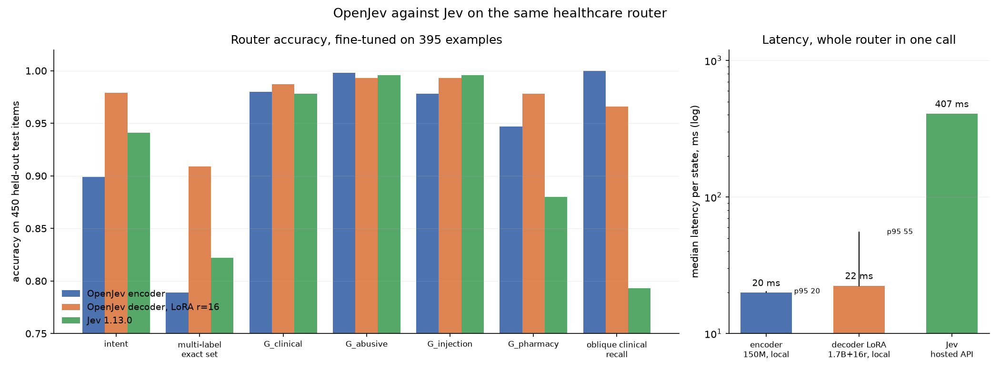

# Results

The headline measurements, the failures worth knowing about before you
build on this, and where to find the full analysis.

**This file is deliberately short.** Every table here is reproduced and
argued at length in the [technical report](../report/), which is the
archival account. What stays here is the set of numbers you need in order
to decide whether to use this project, plus the results that exist only in
this repository and nowhere else yet.

> **Provenance.** Every figure attributed to Jev was measured by us against
> the public TypeSafe API, model `jev-1.13.0`, on 20 September 2026, at the
> sample sizes stated. These are black-box measurements of a hosted
> endpoint, on one day, from one network location. Reproduce them before
> relying on them.

## What ships

**The LoRA decoder**: rank-16 adapters on Qwen3-1.7B, an 87 MB artifact on
top of a 3.4 GB backbone. It is the default because it wins the axis that
separated the two backbones, zero-shot transfer, by 29.6x chance against
the encoder's 17.2x.

**The encoder is the alternative**, not the default. Take it when p95
latency binds (20 ms against 56 ms at batch 1) or when a 0.6 GB footprint
matters more than the accuracy. It is a tenth the size and trains in 38
seconds.

| | OpenJev | Jev | verdict |
|--|--|--|--|
| Held-out suite, 7 tasks never trained on | 29.6x chance | **38.3x chance** | **Jev**, on all 7 |
| Held-out CLINC, K=151, never seen it | 0.702 | **0.938** | **Jev** |
| Banking77, never seen it | 0.605 | **0.863** | **Jev** |
| Router intent, fine-tuned | **0.979** | 0.941 | **OpenJev**, p = 9.8e-04 |
| Router multi-label exact set, fine-tuned | **0.909** | 0.822 | **OpenJev**, p = 7.2e-06 |
| `G_pharmacy` scope gate, fine-tuned | **0.978** | 0.880 | **OpenJev**, p = 3.9e-10 |
| Probability precision | full | 0.01 grid, 71.9% hard zeros | **OpenJev** |
| Deterministic | yes | no, no seed | **OpenJev** |

Read the router rows with the asymmetry in mind: we are fine-tuned on that
task's 395 training examples and Jev is zero-shot on it. The comparison is
in our favour by construction. What it shows is that a few hundred labels
outweigh the gap between an open 1.7B model and a closed API, not that the
two models are equal.

On a schema nobody has labelled, Jev leads, and not only on Banking77.

## Zero-shot against Jev, all seven held-out tasks

We compared against Jev on Banking77 alone for most of this project and
described the result as a single 21-point gap. That was the only task we
had measured them on. Running their API over the whole suite, 600 items
per task, gives the honest picture.

| task | K | Jev | 95% CI | OpenJev | 95% CI | |
|--|--|--|--|--|--|--|
| clinc_oos | 151 | **0.938** | [0.918, 0.958] | 0.702 | [0.667, 0.738] | Jev |
| ag_news | 4 | **0.880** | [0.853, 0.905] | 0.793 | [0.760, 0.828] | Jev |
| banking77 | 77 | **0.863** | [0.835, 0.890] | 0.605 | [0.570, 0.642] | Jev |
| massive_intent | 60 | 0.838 | [0.807, 0.867] | 0.775 | [0.742, 0.807] | level |
| civil_comments | 2 | 0.748 | [0.713, 0.785] | 0.742 | [0.710, 0.777] | level |
| sst5 | 5 | **0.560** | [0.522, 0.598] | 0.465 | [0.425, 0.502] | Jev |
| helpsteer | 5 | **0.415** | [0.378, 0.455] | 0.273 | [0.240, 0.312] | Jev |
| **mean multiple of chance** | | **38.3x** | | 29.6x | | **Jev** |

**Jev wins five and ties two. It does not lose one.** The two ties are
`massive_intent` and `civil_comments`, where the intervals overlap.

Their Banking77 here is 0.863 rather than the 0.820 we recorded earlier.
The service is not deterministic and it changes, so treat both as
measurements at a point in time rather than a fixed property.

Reproduce it without an API key, from the predictions we shipped:

```bash
python -c "import json; d=json.load(open('baselines/jev_heldout_suite.json')); print(d['summary'])"
```

**What this changes and what it does not.** It does not touch the router
result, where we are fine-tuned and win three with four ties. It does
correct the framing: the case for OpenJev is not that it approaches a
commercial API zero-shot, because it does not, on any task we tried. The
case is that a few hundred labels of your own beat that API on your own
task, and that you get the weights, determinism and full-precision
probabilities along the way.

## Held-out transfer, 7 tasks, 600 rows each

Both backbones on the same audited 279-task mixture with the same
augmentation, scored by `scripts/eval_heldout.py` at each task's full
advertised menu. Harness sanity 1.000 for both.

| task | K | chance | decoder | 95% CI | x chance | encoder |
|--|--|--|--|--|--|--|
| `clinc_oos` | 151 | 0.007 | **0.702** | [0.667, 0.738] | **106.0x** | 0.382 |
| `massive_intent` | 60 | 0.017 | **0.775** | [0.742, 0.807] | **46.5x** | 0.473 |
| `banking77` | 77 | 0.013 | **0.605** | [0.570, 0.642] | **46.6x** | 0.343 |
| `ag_news` | 4 | 0.250 | 0.793 | [0.760, 0.828] | 3.2x | 0.735 |
| `sst5` | 5 | 0.200 | 0.465 | [0.425, 0.502] | 2.3x | 0.412 |
| `civil_comments` | 2 | 0.500 | 0.742 | [0.710, 0.777] | 1.5x | 0.683 |
| `helpsteer` | 5 | 0.200 | 0.273 | [0.240, 0.312] | 1.4x | 0.262 |
| **mean** | | | | | **29.6x** | 17.2x |

Every task improved. `civil_comments` reaches AUROC 0.828, which is the
number to read on a binary task: argmax accuracy there describes the 0.5
threshold as much as the model.

Every task also beats its majority-class baseline, which the encoder's
`helpsteer` did not. That margin is thin: 0.273 against 0.233 at p = 0.010,
and a modest change in sampling could erase it.

Full discussion, including what in the training data produced the transfer,
is in `report/sections/results.tex`.

## Router against Jev, fine-tuned

Rank-16 LoRA on Qwen3-1.7B, 395 training examples, 258 seconds. Paired on
the same 450 test items, exact McNemar. We are fine-tuned; Jev is
zero-shot.

| | OpenJev | Jev | p | winner |
|--|--|--|--|--|
| intent | **0.979** | 0.941 | 9.8e-04 | **OpenJev** |
| multi-label exact set | **0.909** | 0.822 | 7.2e-06 | **OpenJev** |
| `G_pharmacy` | **0.978** | 0.880 | 3.9e-10 | **OpenJev** |
| `G_clinical` | 0.987 | 0.978 | 0.34 | level |
| `G_abusive` | 0.993 | 0.996 | 1.00 | level |
| `G_injection` | 0.993 | 0.996 | 1.00 | level |
| `compound` exact set | 1.000 | 0.909 | 0.50 | level |
| `compound_3` exact set | 0.903 | 0.645 | 0.057 | level |
| `clinical_oblique` recall | 0.966 | 0.793 | 0.063 | level |

Three wins, six level, no losses.

**Three of the level rows have large deltas and too few items.**
`compound_3` is +0.258 and oblique-clinical recall is +0.172, both with
zero or near-zero losses, and both miss significance only because those
tiers hold 31 and 29 items. We report them as level because that is what
the test says. Do not read them as parity; read them as underpowered. Note
also that the two tiers where Jev was weakest are the two where our lead is
largest, and that a 29-item tier with zero losses floors at p = 0.0625, so
it cannot reach significance however good the model is.

Reproduce:

```bash
uv run python scripts/eval_router.py --ckpt <ckpt> --dump /tmp/ours.json
uv run python scripts/compare_to_jev.py --ours /tmp/ours.json \
    --jev baselines/jev_healthcare_router.json
```



The latency panel is not like-for-like: our figures are local GPU compute
and Jev's is an end-to-end call to a hosted service including network
round-trip. It is the latency a user experiences, not a claim about the
speed of their model. Rebuild it with `scripts/plot_comparison.py`, which
carries the provenance of every number in it.

## Negative results

This project documents failures as prominently as successes. These four are
the ones that would change what you do.

### 1. We had been scoring truncated menus

An audit against a clean clone found a measurement bug that inflated our
transfer numbers. The packer drops options to fit `max_len`, always keeping
gold. At `--max-len 2048`, which our evaluation runs used, **`clinc_oos`
presented 64 of its 151 options and `banking77` presented 64 of 77.** The
multiple of chance was still computed against 1/151 and 1/77, so a model
choosing among 64 options was credited as though it had chosen among 151.
The accuracies were real; the multiples were not.

Withdrawn, and replaced by the table above:

| | published | corrected | why |
|--|--|--|--|
| encoder held-out mean | 21.9x | **17.2x** | came from the in-training evaluator on a superseded suite; does not reproduce |
| decoder held-out mean | 32.8x | **29.6x** | menus truncated to 64 |
| `banking77`, decoder | 0.737 | **0.605** | 64 of 77 options shown |
| `clinc_oos`, decoder | 0.783 | **0.702** | 64 of 151 options shown |

The gap to Jev on Banking77 is therefore **21 points, not the 9 we
claimed**.

It took two passes to correct. The first used `--max-len 4096`, which fits
banking77's 77 options but still clips `clinc_oos` to 64, because the
decoder's per-option template costs tokens the encoder's does not. The full
151-way menu needs `--max-len 6144`, and every number above was produced at
that budget with no truncation warning.

`scripts/eval_heldout.py` now measures the menu the model actually saw,
scores the multiple against that number, prints `K->k` when they differ,
and ends with a warning naming every truncated task. Note that the script's
own default is still 4096, so pass `--max-len 6144` to reproduce the table
above. The bug is detectable now rather than silent.

### 2. The decoder transfers better and deploys worse

It wins all seven public benchmarks and loses the one task with an
operational shape.

| | encoder | LoRA decoder |
|--|--|--|
| held-out suite | 17.2x | **29.6x** |
| router intent, zero-shot | **0.601** | 0.467 |
| router multi-label exact, zero-shot | **0.243** | 0.207 |
| `G_clinical` recall, zero-shot | 0.111 | **0.380** |
| `G_pharmacy` recall / FPR, zero-shot | not measured | 0.440 / 0.696 |

The ordering reverses on packed multi-question states, compound
multi-label answers, and gates with recall floors. Neither backbone is
deployable zero-shot, so the architecture call stands: it rests on transfer
where no labels exist and fine-tuned accuracy where they do, and the
decoder wins both. What this does change is how much weight 29.6x deserves.
**Benchmark transfer measured what we asked of it and did not predict
deployment readiness**, and running only the suite would have hidden that.

Safety gates in particular appear to need task supervision. There is no
useful zero-shot version of "catch obliquely-worded clinical risk at a
controlled false-positive rate", and we would not deploy any zero-shot gate
on this evidence.

### 3. Starting a task adapter from the general adapter is worse

The LoRA form of the +36-point encoder result, and it reverses.

| init | intent accuracy | 95% CI |
|--|--|--|
| base Qwen3 | **0.979** | [0.962, 0.994] |
| general adapter | 0.953 | [0.926, 0.973] |

Paired McNemar on the same 338 items: **p = 0.012**, base-only-right 10,
general-only-right 1. The general initialisation is significantly worse,
against **+36 points** for the identical move on the encoder.

The encoder had to learn what a menu is from 395 router examples, so the
mixture supplied a capability it did not otherwise have. Base Qwen3 already
reads menus from pretraining, so the mixture supplies nothing new and its
279-task specialisation is net interference on a narrow intent problem.
Negative transfer, and the second time this project has measured it.

**The practical rule.** Stage your fine-tuning when the base model cannot
do the task form at all. Once it can, train the task adapter directly from
base and skip the intermediate stage. The general adapter is still the
right artifact for zero-shot, where there is no task data to train on; it
is the wrong starting point when there is.

### 4. An unmerged LoRA adapter costs 1.96x for nothing

The adapter is an extra matmul per target module at every layer. Left
unmerged it nearly doubles latency; folded into the base weights it almost
disappears.

| | p50 | p95 | vs encoder |
|--|--|--|--|
| encoder, 150M | 37.7 ms | 50.9 ms | |
| decoder LoRA, unmerged | 74.0 ms | 110.5 ms | 1.96x |
| decoder LoRA, merged | **40.4 ms** | **55.9 ms** | **1.07x** |

Measured back to back while a training run shared the GPU, so read the
ratios and not the milliseconds. `DecisionModel` merges on load so this
cannot be paid by accident, and `merge_adapter()` is exposed for anyone
building their own serving path.

## Measured here, not yet in the report

These results are real measurements that currently exist only in this
repository. They are kept here for that reason and should be migrated.

### Packing against one sequence per question

ModernBERT-base, bf16, H100, 50 questions, median of 10 after warmup. The
alternative to packing is one sequence per question, each carrying its own
copy of the state, run as a batch.

| state | packed tokens | naive tokens | packed | naive | speedup |
|--|--|--|--|--|--|
| ~90 tok | 713 | 3,800 | 9.6 ms | 9.6 ms | 1.00x |
| ~700 tok | 1,133 | 24,800 | 9.7 ms | 51.7 ms | **5.33x** |
| ~2.8k tok | 2,573 | 96,800 | 11.0 ms | 263.5 ms | **23.98x** |

Latency is flat in question count: at a 700-token state, 1 and 50 questions
both take 9.6 ms. **At short states packing buys nothing**, because 9.6 ms
is a fixed-overhead floor and both paths hit it. Reproduce with
[`scripts/bench_packing.py`](../scripts/bench_packing.py). This table is
also in the technical report, which is where the argument for packing is
made.

### Encoder against decoder latency at batch 1

Ten questions and twenty-four options per state, H100, lighter load than
the merge comparison above, so the two sets are not comparable to each
other.

| | encoder, 150M | decoder, 1,725M |
|--|--|--|
| p50 per state | **19.9 ms** | 22.4 ms |
| p95 per state | **20.3 ms** | 55.3 ms |
| throughput | **50.3/s** | 44.6/s |
| checkpoint | **0.6 GB** | 3.4 GB |

11.5x the parameters for 13% more median latency, because everything
happens in one forward pass over a short packed sequence and the cost is
dominated by launch overhead rather than matrix multiplies. **The tail is
the real price**, p95 2.7x worse, which is what matters for a router under
a latency budget and is the reason the encoder stays documented.

### The encoder's intermediate-task transfer, gate by gate

Same router task, same 395 examples, same 6 epochs, same 38 seconds. Only
the starting weights differ. This is the result the decoder reverses, see
negative result 3.

| | from raw ModernBERT | from the first general ckpt | from the best general ckpt | Jev |
|--|--|--|--|--|
| intent | 0.544 | 0.817 | **0.899** | 0.941 |
| multi-label exact set | 0.453 | 0.718 | **0.789** | 0.822 |
| multi-label F1 | 0.554 | 0.816 | **0.855** | 0.890 |
| `G_clinical` recall | 0.898 | 0.991 | **1.000** | 0.926 |
| `clinical_oblique` recall | 0.931 | 0.966 | **1.000** | 0.793 |
| `G_abusive` recall | 0.000 | 0.429 | **0.857** | 0.714 |
| `G_injection` recall | 0.125 | **0.750** | 0.583 | 0.917 |
| `G_pharmacy` FPR, lower better | 0.826 | 0.783 | **0.652** | |

Paired McNemar against from-scratch: intent b10=108, b01=16, p = 6.0e-18;
multi-label b10=144, b01=25, p = 1.6e-21. 395 examples across 10 questions
is about 40 per question, and two gates had so few positives (`G_abusive`:
7) that from scratch they never learned to fire at all.

### The encoder against Jev, paired

The fine-tuned encoder specialist, for the case where you take the
low-latency path. It loses intent and the injection gate, which the decoder
does not.

| | OpenJev encoder | Jev | p | winner |
|--|--|--|--|--|
| intent | 0.899 | 0.941 | 0.039 | Jev |
| multi-label exact set | 0.789 | 0.822 | 0.142 | level |
| `G_clinical` | 0.980 | 0.978 | 1.000 | level |
| `G_abusive` | 0.998 | 0.996 | 1.000 | level |
| `G_injection` | 0.978 | 0.996 | 0.008 | Jev |
| `G_pharmacy` | **0.947** | 0.880 | 3e-04 | **OpenJev** |
| `clinical_oblique` recall | **1.000** | 0.793 | 0.031 | **OpenJev** |

Every intent row on this page is scored against Jev's **strict** 0.941 over
the 338 single-gold items, not its lenient 0.909 over all 450.
`eval_router.py` had been using the wrong denominator, which understated
the gap by about three points in our favour. See
[evaluation](evaluation.md#reference-baseline-test-n450).

### A frozen decoder with a trained head, and a clean split by primitive

A 4.2M-parameter residual scorer on a frozen Qwen3-1.7B, one epoch over a
141-task mixture. Mean **16.2x chance**, against 9.7x for the encoder of
that generation and 11.5x for the same decoder untrained.

| held-out task | K | encoder | decoder + head | x chance |
|--|--|--|--|--|
| `clinc_oos` | 151 | 0.180 | **0.420** | 63.4x |
| `banking77` | 77 | 0.205 | **0.355** | 27.3x |
| `massive_intent` | 60 | 0.305 | 0.290 | 17.4x |
| `ag_news` | 4 | **0.655** | 0.490 | 2.0x |
| `sst5`, `score` | 5 | **0.360** | 0.185 | 0.9x |
| `helpsteer`, `score` | 5 | 0.230 | 0.235 | 1.2x |
| `civil_comments`, `noul` | 2 | 0.500 | 0.490 | 1.0x |

**The split is the finding.** Every task above chance is a `choice`
question and every task at chance is `score` or `noul`. The two backbones
behaved as complements at this stage: the decoder won the large menus by a
wide margin and the encoder won every menu with five options or fewer. That
is not an architecture verdict on `score` and `noul`, because the mixture
held 128 `choice` questions against 13 `noul` and **zero** `score`, so the
model was never taught the ordinal primitive at all.

### Recasting `choice` as yes/no fixes a degenerate binary

Three encoder runs, identical except for the augmentation flags, same
143-task mixture, one epoch each.

| held-out task | no augmentation | `--scale-prob 0.5` | `+ --noul-prob 0.25` |
|--|--|--|--|
| `clinc_oos`, K=151 | 0.490 | 0.445 | **0.518** |
| `banking77`, K=77 | 0.187 | 0.212 | **0.278** |
| `massive_intent`, K=60 | **0.362** | 0.348 | 0.298 |
| `ag_news` | **0.560** | 0.492 | 0.408 |
| `sst5`, `score` | 0.342 | **0.348** | 0.308 |
| `helpsteer`, `score` | 0.110 | 0.128 | **0.222** |
| `civil_comments`, `noul` | 0.498 | 0.500 | **0.528** |
| `civil_comments` macro-F1 | 0.333 | 0.333 | **0.403** |
| **mean x chance** | 16.5x | 15.7x | **17.6x** |

The macro-F1 row is the one that matters. A binary task at 0.333 macro-F1
is a model answering the same way every time, and it had done that in every
run until this one. **It is not an accuracy win.** At n=600 the CI is
[0.490, 0.572] against a 0.500 floor, so only the collapse is fixed.
`helpsteer` doubles but lands exactly on its 0.233 majority-class baseline,
which is not skill either.

### Banking77 in-task specialist

ModernBERT-base, 3 epochs, one H100, 13.5 minutes. **In-task**: we trained
on 9,839 Banking77 examples and Jev did not, so this measures what labels
buy rather than which model is better.

| | accuracy | macro-F1 | ECE | Brier |
|--|--|--|--|--|
| raw | 0.9233 | 0.9230 | 0.056 | 0.1300 |
| temperature-scaled | **0.9233** | 0.9230 | **0.029** | 0.1194 |

Temperature scaling behaved exactly as theory requires: accuracy identical
to four decimal places while ECE halves. It is monotonic and cannot reorder
predictions, so had accuracy moved, the implementation would be wrong.

### Two engineering faults worth repeating

**A double-registered backbone.** Adding LoRA introduced
`self._base = self.lm`, which is an `nn.Module` attribute assignment and
therefore registered the backbone a second time, writing every tensor into
the state dict twice. It is a property now. Checkpoints written with the
duplicates still load, since the real keys were always present under their
own names.

**Autocast hid a dtype bug until evaluation.** The decoder head is float32
on a bf16 backbone. Under `torch.autocast` that mixes silently, so a
58-minute training run completed normally and then every held-out task
failed with `expected scalar type BFloat16 but found Float`. The weights
were fine and the run did not need repeating, but the failure landed after
the expensive part rather than in the first second. The head now casts to
its own dtype explicitly instead of relying on an ambient autocast context.

### Mixture generations

Several training mixtures appear in older results and they are not
interchangeable. Each row is a superset of the ideas above it. None of
these directories is committed; rebuild them with
`scripts/build_mixture.py`.

| mixture | tasks | rows | `choice` / `noul` / `score` | what changed |
|--|--|--|--|--|
| `mixture` | 61 | | | first attempt; transferred nothing |
| `mixture_big` | 141 | 189,462 | 128 / 13 / 0 | rebuilt with an auth token and backoff |
| `mixture_ord2` | 143 | 192,462 | 121 / 13 / 9 | ordinal label sets detected and emitted as `score` |
| `mixture_noul` | 143 | 192,462 | 100 / 34 / 9 | negation pairs retyped from `choice` to `noul` |
| `mixture_ord3` | 145 | 198,154 | 100 / 34 / 11 | curated star-rating datasets added |
| `mixture_final` | 279 | 323,466 | 234 / 34 / 11 | MultipleChoice family ingested, audited clean |

Where an older result names a figure like "13 `noul` tasks", it is
describing the mixture that run used, not the current one.

## Claims we retracted

Kept deliberately, because a results file that only grows in one direction
is not evidence.

| claim | why it was wrong |
|--|--|
| Banking77 zero-shot 0.325, 25x chance | measured at n=40; at n=200 it is 0.205 |
| "OpenJev beats Jev at oblique clinical detection" | 5-0 on items but p = 0.0625 at n=29 |
| `G_pharmacy` 0.942 against 0.880, our best gate | class imbalance; our FPR is 0.783 |
| "`G_pharmacy` cannot be rescued by any checkpoint" | a better one took FPR to 0.652 and the gate to a win |
| "The held-in control would have caught the dropped head" | the decoder reads 1.0x to 1.3x there even when it loads |
| "The encoder cannot generalize" | true of a 61-task mixture, not of the architecture |
| "The warm start is the cheap lever" | it gives nothing; the data stage does the work |
| "The decoder is not worth using" | decided on zero-shot transfer alone, before any fine-tuned or latency comparison existed |
| Precision recoverable by inverting `confidence` | real but under 0.018, and no extra threshold granularity |

## Everything else

The full account, with the argument attached, is in the report:

| what | where |
|--|--|
| Held-out transfer, the truncation correction, the architecture decision | `report/sections/results.tex` |
| Failed interventions, the retracted `noul` conclusion, adapter init | `report/sections/ablations.tex` |
| Limitations, missing baselines, when this fits a real problem | `report/sections/discussion.tex` |
| Mixture composition, contamination guard, the data audit | `report/sections/data.tex` |
| Packing, the attention mask, readout and loss | `report/sections/method.tex` |
| Hyperparameters, artifacts, reproduction commands | `report/sections/appendix.tex` |

## Not yet measured

- Latency served the same way as Jev. Ours is local compute; Jev's included
  a 331 ms round trip from India.
- Expected cost per decision with real per-class prices, which is the
  metric that should actually decide deployment.
- `m` independent single-question classifiers, the obvious alternative to
  packing. `scripts/baseline_separate.py` exists to run it and has not
  been run.
- Whether the encoder gap is capacity or data, which needs ModernBERT-large.
- Seed variance. Every number here is a single training run, and the
  bootstrap intervals capture test-set sampling only.
