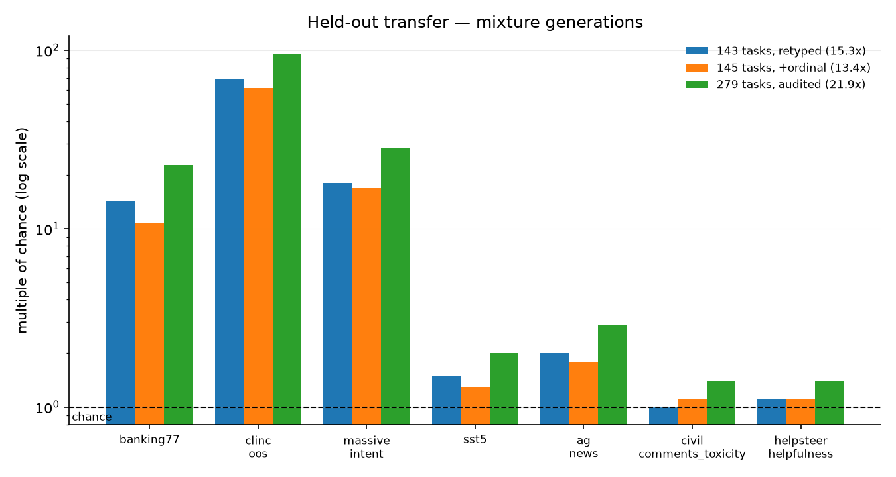

# OpenJev encoder, general checkpoint

A general typed-decision model. You give it a state and a set of questions, it
answers all of them in **one forward pass** over a shared prefix, returning a
calibrated probability per option rather than generated text.

Its job is to be the thing you fine-tune *from*. On a 395-example routing
task, starting here instead of from raw ModernBERT is worth **+36 accuracy
points** for the same 38 seconds of training.

Code, training scripts and evaluation harness: https://github.com/S1LV3RJ1NX/openjev

## What it is for

Three question types, matching the shape of a real decision:

- `choice` — pick one of K options, K up to 151 tested
- `score` — an ordered scale
- `noul` — yes/no, and several can be asked at once for multi-label

Good fit for routing, triage, guardrails and tool selection where you have
labels, for long states asked many questions at once, and for regulated data
that cannot leave your network.

## Why pick this over the decoder: throughput

The decoder adapter transfers better zero-shot, 29.6x chance against this
model's 17.2x, and that is the honest headline. This model wins somewhere
that often matters more in production.

| batch | this encoder | decoder |
|---|---|---|
| 1 | 47.4 states/s at 20.4 ms | 23.2 at 42.9 ms |
| 8 | 373.9 states/s at 21.0 ms | 77.1 at 105.0 ms |
| 16 | **654.6 states/s at 24.0 ms** | 77.3 at 206.4 ms |
| 32 | 532.7 states/s at 36.8 ms | 84.4 at 417.0 ms |

Ten questions per state on an idle H100, so the peak is **6,546 decisions
per second**, roughly eight times the decoder. It is also 0.6 GB against
3.4 GB, and its p95 is 20.3 ms against 55.5 ms.

For scale, the commercial API we benchmark against peaks near 47 requests
per second before its median latency starts climbing. Ours is one process
with no HTTP layer, queuing or network, so treat it as what the hardware
can do rather than as a deployment measurement.

Note the knee between batch 16 and 32, where throughput falls and p95
jumps from 29.4 ms to 209.1 ms. Size your batches below it.

**So: this model for volume and tight tail latency, the decoder for
accuracy on schemas you have no labels for.**

## Measured

**Held-out schemas, never trained on** (`scripts/eval_heldout.py`, n=600 per
task, 95% CI over examples). Harness sanity 1.000; held-in control 1.4–2.3x,
so a chance-level row below is a real failure to transfer and not a loading
bug.

| task | K | chance | accuracy | 95% CI | x chance |
|---|---|---|---|---|---|
| clinc_oos | 151 | 0.007 | 0.382 | [0.342, 0.420] | **57.6x** |
| massive_intent | 60 | 0.017 | 0.473 | [0.430, 0.512] | **28.4x** |
| banking77 | 77 | 0.013 | 0.343 | [0.305, 0.382] | **26.4x** |
| ag_news | 4 | 0.250 | 0.735 | [0.698, 0.772] | 2.9x |
| sst5 (`score`) | 5 | 0.200 | 0.412 | [0.373, 0.452] | 2.1x |
| civil_comments (`noul`) | 2 | 0.500 | 0.683 | [0.648, 0.718] | 1.4x |
| helpsteer (`score`) | 5 | 0.200 | 0.262 | [0.225, 0.297] | 1.3x |

**Mean 17.2x chance, and every interval excludes its chance floor.**

An earlier version of this card reported 21.9x, with clinc_oos at 0.628
and banking77 at 0.290. Those are withdrawn. The packer drops options to
fit the context budget while the multiple of chance was still computed
against 1/K, so a model choosing between 64 options was credited as
though it had chosen between 151. The figures above are scored at each
task's full menu.



Three bars per task, one per mixture generation. The middle one is *worse*
than the first: that is negative transfer from a mixture change that traded
away `choice` tasks, kept visible because a chart showing only the best run
would imply steady progress that did not happen.

**Fine-tuned on a healthcare routing task**, 395 examples, 38 seconds, paired
against a commercial typed-decision API on the same 450 items with exact
McNemar:

| | this model | commercial API | p | winner |
|---|---|---|---|---|
| intent | 0.899 | 0.941 | 0.039 | API |
| multi-label exact set | 0.789 | 0.822 | 0.142 | level |
| obliquely-worded clinical risk | **1.000** | 0.793 | 0.031 | **this model** |
| pharmacy scope gate | **0.947** | 0.880 | 3e-04 | **this model** |
| prompt-injection gate | 0.978 | 0.996 | 0.008 | API |

## Limitations, stated plainly

**One task only beats chance, not the trivial baseline.** Chance is not
always the right floor: a skewed task can be beaten by always predicting its
most common label. `civil_comments` beats that baseline outright (0.683
against 0.500, p < 1e-15), but `helpsteer` sits on the line, 0.262 against a
0.233 majority baseline at p = 0.050. Six of seven are unambiguous; that one
is above chance and level with predicting the most common level.

**The mixture is lopsided.** 234 `choice` tasks against 34 `noul` and 11
`score`, so `choice` transfers best and the ordinal primitive is weakest.
That is a property of the training data, not the architecture.

**This is not a zero-shot replacement for a commercial API.** On Banking77
never having seen it, this scores 0.343 against roughly 0.820 for one. The
gap closes only with task-specific fine-tuning. Our LoRA decoder reaches
0.605 on the same items, so if zero-shot accuracy is what you need and
latency is not binding, start there instead.

**Two augmentations were tried on the ordinal gap and one failed.** Ordinal
scale augmentation was a measured null result and is documented as such in
the repo rather than quietly dropped.

## Training

- Base: `answerdotai/ModernBERT-base`
- 279 tasks, 323,466 rows, assembled from `tasksource`, one epoch, audited
  to zero errors and verified to pack before training
- Label-space augmentation (p=0.5, menus padded up to 120 options), which is
  what makes K=77 and K=151 work at all — without it those score a literal
  0.000
- Recasting `choice` into yes/no (p=0.25), which removes the degenerate
  always-one-class behaviour on binary tasks
- A contamination guard asserts none of the held-out datasets, under any
  alias, appear in the training mixture

## Use

```bash
git clone https://github.com/S1LV3RJ1NX/openjev && cd openjev
hf download s1lv3rj1nx/openjev-encoder-general model.pt --local-dir checkpoints/general

uv run python scripts/train.py --task tasks/your_task \
    --init-from checkpoints/general/model.pt --epochs 6 --bs 8
```

Starting from this checkpoint rather than from scratch was worth **+36
points** on a 395-example task, so it is the right move on the encoder
path. It does not carry over to the decoder path: a LoRA adapter
initialised from our general adapter scored 0.953 against 0.979 from base
weights (p = 0.012). Stage your fine-tuning when the base model cannot do
the task form at all, and train from base once it can.

The checkpoint is a plain `torch.save` dict holding `state_dict`, `backbone`,
the fitted per-question `temperatures`, and the mixture it was trained on. It
needs the `openjev` package to load, since the packing and grouped
log-softmax are not a stock `transformers` architecture.

## Licence

Apache 2.0.
